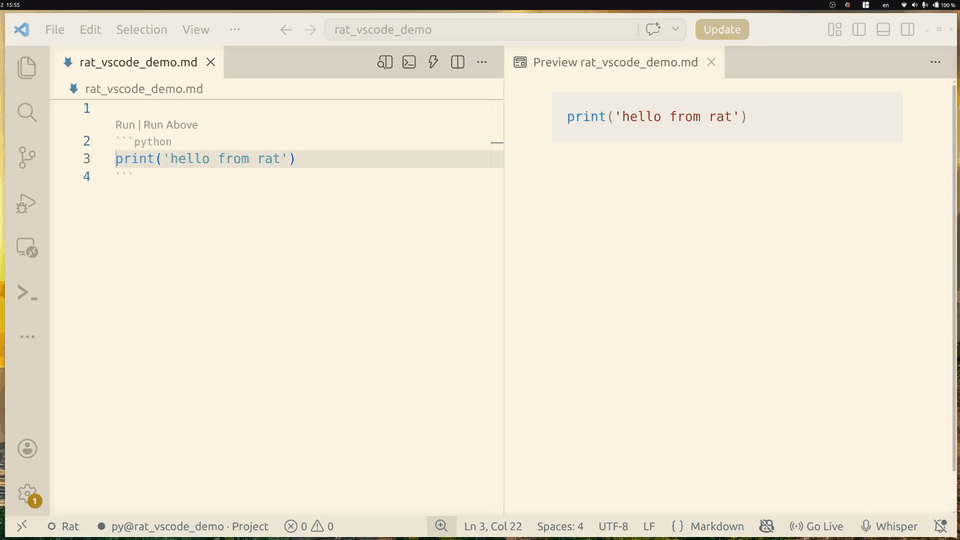

# Rat — VS Code Extension

Run code cells in Markdown (`.md`) and Quarto (`.qmd`) files, powered by [rat](https://github.com/maximerivest/rat) kernels.



Works **on top of** whatever Markdown / Quarto extension you already use — it only adds code execution.

## Features

| Feature | How |
|---------|-----|
| **Run cells** | `▶ Run` CodeLens above each cell, or `Ctrl+Enter` |
| **Output cells** | Results appear in ` ```output ``` ` blocks below |
| **Plots** | Matplotlib PNGs saved to `_assets/`, inserted as images |
| **Execution queue** | Cells queue up, execute in order |
| **Pause / Cancel** | Status bar toggle, `Ctrl+Shift+C` to cancel |
| **Completions** | Live from kernel — sees your DataFrames, imports, etc. |
| **Hover** | Rich inspection on hover (type, shape, docs, methods) |
| **stdin prompts** | `input()` pops a VS Code input box |
| **Run Above / Run All** | Execute cells from top, or the whole file |
| **Rendered Markdown editor** | Optional mrmd-powered editable Markdown view with rat-backed code cells |

## Prerequisites

The extension can install the `rat` CLI for you on first use on supported macOS, Linux, and Windows platforms. When you run a cell and `rat` is not found, choose **Install Rat** and the extension downloads the CLI into VS Code storage and mirrors it into your normal terminal `PATH` when possible, so `rat` works from shells too.

Manual install is still supported:

```bash
# macOS / Linux
curl -fsSL https://runanything.dev/install.sh | sh

# Windows PowerShell
irm https://runanything.dev/install.ps1 | iex

rat install py    # or sh, r, ju, js
```

If you already have a custom binary, set `rat.path` or run **Rat: Install CLI** / **Set rat.path** from the prompt. **Rat: Install CLI** also updates the extension-managed and PATH-visible binary to the latest release.

## Install the extension

```bash
cd vscode-rat
npm install
npm run build

# Option A: development mode
# Open this folder in VS Code, press F5

# Option B: install globally
npm run package
code --install-extension rat-<version>.vsix
```

## Usage

Open any `.md` or `.qmd` file with fenced code blocks:

````markdown
```python
import pandas as pd
df = pd.read_csv("data.csv")
df.head()
```
````

Click **▶ Run** above the cell. Output appears below:

````markdown
```output
   region quarter  revenue
0   East      Q1    42000
1   West      Q1    38000

✓ 150ms | 2 vars
```
````

### Rendered Markdown editor

For a more rendered, notebook-like editing surface, run **Rat: Open Rat Markdown Editor** or **Markdown: Open Preview (Rat Markdown)** from the Command Palette, or use **Open With… → Rat Markdown** on a Markdown/Quarto/R Markdown file.

This opens an editable mrmd-powered view (not VS Code's Markdown preview). Markdown renders inline, focused sections remain editable, and code cells execute through the same rat runtime resolution as the normal text editor.

If you want `Ctrl+Shift+V` / `Cmd+Shift+V` to open Rat Markdown instead of VS Code's built-in Markdown preview, run **Rat: Use Rat Markdown for Ctrl+Shift+V Preview** or set `rat.replaceMarkdownPreviewShortcut` to `true`. To make Rat Markdown the default editor for `.md` / `.qmd` / `.rmd` files in the current workspace, run **Rat: Use Rat Markdown as Default Markdown Editor**.

By default, Rat Markdown uses a paper-like page view when there is enough horizontal space, similar to Google Docs or Word. Set `rat.markdownPageMode` to `"always"`, `"auto"`, or `"never"` to control that behavior. Run **Rat: Configure Rat Markdown Appearance** to quickly find the related settings, including theme associations and the page canvas background.

### Keybindings

| Key | Action |
|-----|--------|
| `Ctrl+Enter` | Run cell at cursor |
| `Shift+Enter` | Run cell and advance to next |
| `Ctrl+Shift+Enter` | Run all cells above (inclusive) |
| `Ctrl+Shift+C` | Cancel execution |

### Runtime resolution

The extension decides which rat kernel to use:

1. **Front matter** — per-file override:
   ```yaml
   ---
   rat:
     python: py-ml
   ---
   ```

2. **VS Code setting** — per-workspace:
   ```json
   { "rat.runtimes": { "python": "py-ml" } }
   ```

3. **Default** — canonical language name (`py`, `sh`, `r`, …)

CWD is always the VS Code workspace folder.

### Plots

When your code calls `plt.show()`, the figure is saved as a PNG
in `_assets/` (configurable via `rat.assetsDir`) and inserted as
a Markdown image after the output block:

```markdown

```

## Settings

| Setting | Default | Description |
|---------|---------|-------------|
| `rat.path` | `"rat"` | Path to the rat binary. Leave as `"rat"` to use an extension-managed install when present, otherwise PATH. |
| `rat.autoInstall` | `"prompt"` | Offer to install the rat CLI into VS Code extension storage when missing (`"prompt"`, `"never"`) |
| `rat.runtimes` | `{}` | Map fence language → named runtime |
| `rat.maxOutputLines` | `100` | Max lines in output cells (0 = unlimited) |
| `rat.assetsDir` | `"_assets"` | Plot image directory (relative to workspace) |
| `rat.replaceMarkdownPreviewShortcut` | `false` | Use Rat Markdown for `Ctrl+Shift+V` / `Cmd+Shift+V` in Markdown-like files |
| `rat.markdownPageMode` | `"auto"` | Page-style Rat Markdown layout: `"auto"`, `"always"`, or `"never"` |
| `rat.markdownThemeAssociations` | VS Code host themes | Map VS Code light/dark/high-contrast kinds to mrmd theme names |
| `rat.markdownPageCanvasBackground` | `"auto"` | Background around the page (`"auto"`, `"editor"`, `"sideBar"`, `"panel"`, `"transparent"`, or CSS color) |
| `rat.markdownFontScale` | `1` | Relative font scale for Rat Markdown compared with VS Code's editor font size |

## Commands

All available via the Command Palette (`Ctrl+Shift+P`):

- **Rat: Run Cell** / **Run Cell and Advance** / **Run Above** / **Run All Cells**
- **Rat: Configure Rat Markdown Appearance** — open Rat Markdown theme/page settings
- **Rat: Install CLI** — download the rat binary into VS Code extension storage
- **Rat: Cancel Execution** / **Clear Queue** / **Pause / Resume Queue**
- **Rat: Clear All Outputs** — remove all ` ```output ``` ` blocks
- **Rat: Show Variables** — open variable overview in a side panel
- **Rat: Stop Kernel** / **Restart Kernel**
